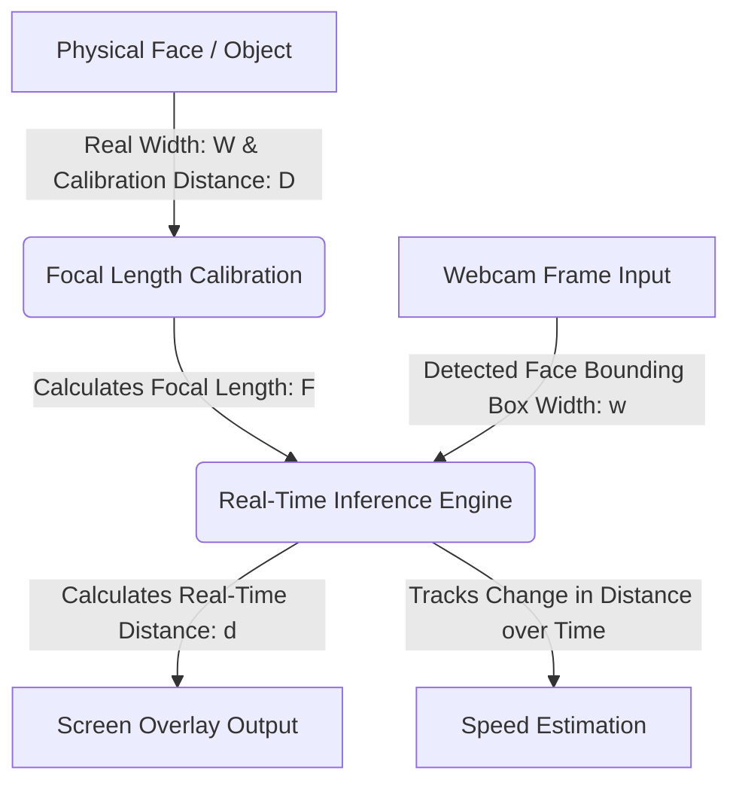

# 📷 Real-Time Distance & Speed Estimation Using a Single Camera

 

Estimate the real-time distance and movement speed of objects using a standard camera or webcam. This project implements the **Triangle Similarity** (Pinhole Camera Model) algorithm to calculate how far an object is from the camera lens without requiring expensive depth sensors or LIDAR.

---

## 📖 Working Principle

The project relies on basic camera optics. By analyzing a reference image of an object at a known distance, we calculate the camera's focal length. Any subsequent change in the object's pixel width allows us to calculate its new distance.



### 1. Focal Length Calibration
To calculate the camera's constant **Focal Length ($F$)**, position a target object with a known physical width ($W$) at a measured physical distance ($D$) from the camera. The object's pixel width ($P$) is determined from the captured reference frame:

$$F = \frac{P \times D}{W}$$

*   **Reference Constants used in this project:**
    *   **Known Distance ($D$):** $76.2 \text{ cm}$ (or $30 \text{ inches}$)
    *   **Real Width of Face ($W$):** $14.3 \text{ cm}$ (or $5.7 \text{ inches}$)

### 2. Distance Estimation
Once the Focal Length ($F$) is calibrated, the distance ($d$) of the object from the camera is calculated in real-time using the detected pixel width ($w$) in each frame:

$$d = \frac{W \times F}{w}$$

### 3. Speed Estimation
Speed is tracked by calculating the change in the estimated distance between subsequent frames over the change in time:

$$\text{Velocity } (v) = \frac{|d_{\text{current}} - d_{\text{previous}}|}{t_{\text{current}} - t_{\text{previous}}}$$

A rolling average filter is applied to the calculated velocities to smooth out jitter and deliver stable speed readouts.

---

## 🎥 Video Tutorials

*   [**Distance Estimation YouTube Tutorial**](https://youtu.be/zzJfAw3ASzY)
*   [**Distance & Speed Estimation YouTube Tutorial**](https://youtu.be/DIxcLghsQ4Q)
*   [**YoloV4 Object Detection & Distance Estimation**](https://youtu.be/FcRCwTgYXJw)

---

## 🛠️ Repository Structure

*   **`distance.py` / `Updated_distance.py`**: Desktop visualizers using OpenCV and Haar Cascade face detection.
*   **`Speed/`**: Desktop speed calculation engine.
*   **`Raspberry_pi/`**: Custom optimized scripts for CSI camera modules on Raspberry Pi.
*   **`web_app/`**: Client-side web application leveraging **MediaPipe Face Mesh** for sub-pixel eye tracking and real-time canvas overlays.

---

## 🚀 Quick Start Guide

### 1. Clone the Repository
```bash
git clone https://github.com/shubham-chakrawarti/Distance_measurement_using_single_camera
```

### 2. Install Dependencies
```bash
pip install opencv-python
```

### 3. Run the Desktop Distance Visualizer
```bash
# Original Version
python distance.py

# Updated Version (Enhanced HUD)
python Updated_distance.py
```

### 4. Run the Speed Estimation Tracker
```bash
python Speed/speed.py
```

---

## 📫 Let's Connect

<div align="center">

[](https://www.youtube.com/@shubham-chakrawarti)
[](https://www.instagram.com/shubham_chakrawarti)
[](https://www.linkedin.com/in/shubham-chakrawarti)
[](https://twitter.com/shubham_c)
[](https://medium.com/@shubham-chakrawarti)
[](https://shubham-chakrawarti.github.io)

### 💼 Freelance Profiles

[](https://www.fiverr.com/shubham_c)
[](https://kwork.com/user/shubham_c)

</div>
